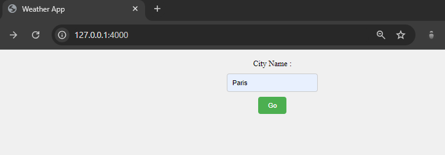
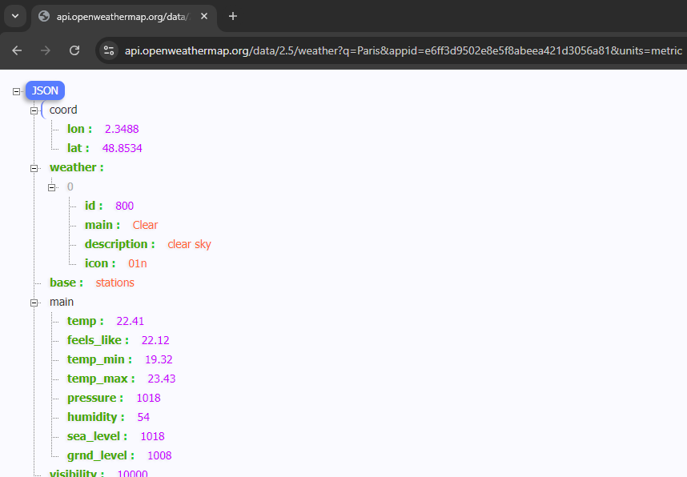

Type in the city name to know the weather

cmd : nodemon app.js

https://api.openweathermap.org/data/2.5/weather?q=Paris&appid=e6ff3d9502e8e5f8abeea421d3056a81&units=metric

http://openweathermap.org/img/wn/012@2x.png

http://openweathermap.org/img/wn/"+icon+"@2x.png

